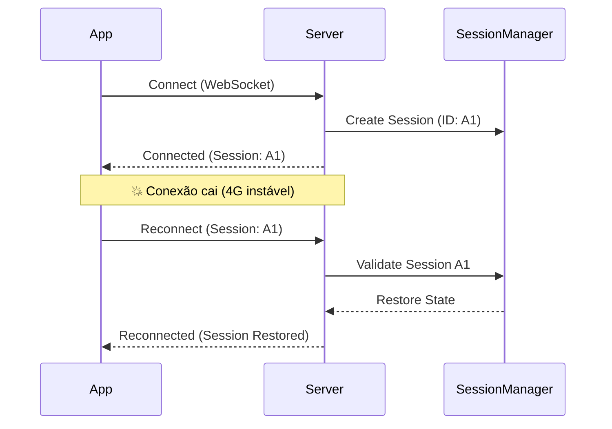

# websocket_core

**O Backend WebSocket Definitivo para Dart.**

Sessões persistentes, reconexão automática, validação de schema e arquitetura escalável — zero dependências externas.

[](https://pub.dev/packages/websocket_core)
[](https://dart.dev)
[](LICENSE)

---

## 🚀 Por que websocket_core?

- **Zero Boilerplate:** Validação, serialização e roteamento prontos.
- **Sessão > Conexão:** Se a internet cair, a sessão (e o estado) sobrevive.
- **Client SDK Incluso:** Cliente Dart/Flutter que já fala o protocolo.
- **Protocolo Explícito:** Versionamento e tipagem forte em cada mensagem.
- **Zero Dependências:** Puro `dart:io`. Leve e rápido.

---

## 📦 Instalação

```yaml
dependencies:
  websocket_core: ^1.2.1
```

---

## ⚡ Quick Start

### 1. Crie o Servidor

```dart
import 'package:websocket_core/websocket_core.dart';

void main() async {
  // Configuração rápida para desenvolvimento
  final server = WsServer(
    config: WsServerConfig.dev(port: 8080),
  );

  // Define o schema do payload (Opcional, mas recomendado)
  final chatSchema = {
    'text': (v) => v is String && v.isNotEmpty,
    'roomId': (v) => v is String,
  };

  // Handler moderno com Auto-Reply
  server.on('chat.message', (ctx) async {
    final text = ctx.payload['text'];
    final roomId = ctx.payload['roomId'];

    print('Msg: $text');

    // Broadcast para outros usuários
    ctx.broadcastToRoom(roomId, 'chat.new_message', {
      'text': text,
      'sender': ctx.userId ?? 'anon',
    });

    // Em 1.2.0, basta retornar o valor para responder ao remetente!
    return {'status': 'sent', 'timestamp': DateTime.now().millisecondsSinceEpoch};
  }, schema: chatSchema);
  
  // Handler de Join
  server.on('room.join', (ctx) async {
     final roomId = ctx.payload['roomId'];
     server.rooms.join(roomId, ctx.session);
     return {'joined': roomId};
  });

  await server.start();
  print('Server listening on ws://localhost:8080/ws');
}
```

### 2. Conecte o Cliente (Flutter/Dart)

```dart
import 'package:websocket_core/websocket_core.dart';

void main() async {
  final client = WsClient('ws://localhost:8080/ws');

  // Reconexão e Handshake são automáticos
  await client.connect();

  client.on('chat.new_message', (data) {
    print('Nova mensagem de ${data['sender']}: ${data['text']}');
  });
  
  client.on('ack', (data) => print('Mensagem entregue!'));

  // Entra na sala
  client.send('room.join', {'roomId': 'geral'});

  // Envia mensagem
  client.send('chat.message', {
    'roomId': 'geral',
    'text': 'Olá mundo!',
  });
}
```

---

## 🔄 Ciclo de Vida & Arquitetura

O diferencial do `websocket_core` é tratar **Sessão** e **Conexão** como entidades distintas.



1. **Conexão:** O socket TCP/IP. Pode cair a qualquer momento.
2. **Sessão:** O estado do usuário (autenticação, salas, variáveis). Sobrevive à queda da conexão.
3. **Reconexão:** O cliente tenta reconectar enviando o ID da sessão anterior. Se válida, tudo é restaurado.

---

## 📚 Cookbook: Receitas Práticas

### Validação Declarativa
Esqueça os `if (data['id'] == null)`. Use schemas:

```dart
server.on('transfer', (ctx) async {
  // Lógica de transferência...
}, schema: {
  'amount': (v) => v is num && v > 0,
  'toAccount': (v) => v is String && v.length == 10,
});
// O servidor retorna erro automaticamente se a validação falhar
```

### Autenticação JWT
Implemente `WsAuthenticator` para proteger seu servidor.

```dart
class JwtAuth extends WsAuthenticator {
  @override
  Future<AuthResult> authenticate(WsConnection conn, String? token) async {
    if (token == null) return AuthResult.failure(error: 'Token missing');
    try {
      final userId = verifyJwt(token); // Use sua lib de JWT preferida
      return AuthResult.success(userId: userId);
    } catch (_) {
      return AuthResult.failure(error: 'Invalid token');
    }
  }
}

// Uso:
final server = WsServer(
  config: WsServerConfig.prod(port: 8080, requireAuth: true),
  authenticator: JwtAuth(),
);
```

### Tipagem Forte com DTOs
Use o método `bind<T>` para converter payloads em objetos.

```dart
// Seu DTO
class MessageDto {
  final String text;
  MessageDto(this.text);
  
  factory MessageDto.fromMap(Map<String, dynamic> map) {
    if (map['text'] is! String) throw Exception('Invalid text');
    return MessageDto(map['text']);
  }
}

// Handler
server.on('msg', (ctx) async {
  // Valida e converte em uma linha
  final msg = ctx.bind(MessageDto.fromMap);
  print(msg.text);
});
```

### Request-Response (RPC)
Ao invés de apenas enviar e torcer para chegar, aguarde uma resposta específica:

```dart
// Client
try {
  final response = await client.request('get.user', {'id': '123'});
  print('User: ${response['name']}');
} catch (e) {
  print('Error: $e');
}

// Server
server.on('get.user', (ctx) async {
  // Auto-Reply: Retorne um Map/List e o servidor responde automaticamente!
  return {'id': ctx.payload['id'], 'name': 'Murillo'};
});
```

### Organizando com Controllers
Para apps grandes, não encha seu `main.dart` de handlers. Use `WsController`:

```dart
class ChatController extends WsController {
  @override
  void register(WsServer server) {
    server.on('chat.send', _onSend);
    server.on('chat.join', _onJoin);
  }

  Future<dynamic> _onSend(WsContext ctx) async {
    // Lógica aqui...
    return {'status': 'sent'};
  }

  Future<dynamic> _onJoin(WsContext ctx) async { ... }
}

// No main:
server.registerController(ChatController());
```

---

## ⚙️ Configuração Avançada

### Produção vs Desenvolvimento

```dart
// Dev: Timeouts relaxados, sem auth obrigatória
final dev = WsServerConfig.dev();

// Prod: Timeouts agressivos, auth forçada, limpeza rápida
final prod = WsServerConfig.prod(
  port: 8080,
  host: '0.0.0.0', 
  corsHeaders: {'Access-Control-Allow-Origin': '*'},
);
```

### Protocolo
O `WsClient` lida com tudo isso, mas se você criar um cliente customizado, as mensagens seguem este formato JSON:

```json
{
  "v": "1.0",           // Versão do protocolo
  "e": "chat.message",  // Nome do Evento
  "p": { "text": "oi" },// Payload (Dados)
  "c": "uuid-123",      // Correlation ID (Opcional, para request-response)
  "t": 1234567890       // Timestamp (ms)
}
```

---

## 🚀 Deployment & Produção

### Nginx (Reverse Proxy)
WebSockets precisam de headers específicos para funcionarem através de proxies.

```nginx
location /ws {
    proxy_pass http://localhost:8080;
    proxy_http_version 1.1;
    proxy_set_header Upgrade $http_upgrade;
    proxy_set_header Connection "upgrade";
    proxy_set_header Host $host;
    
    # Timeouts longos para evitar desconexão
    proxy_read_timeout 3600s;
    proxy_send_timeout 3600s;
}
```

### Docker
O servidor roda em qualquer container Dart. Lembre-se de expor a porta.

```dockerfile
FROM dart:stable AS build
WORKDIR /app
COPY pubspec.* ./
RUN dart pub get
COPY . .
RUN dart compile exe bin/server.dart -o bin/server

FROM scratch
COPY --from=build /runtime/ /
COPY --from=build /app/bin/server /app/bin/
CMD ["/app/bin/server"]
```

---

## ⚠️ Códigos de Erro

O servidor envia estes códigos no evento `sys.error` ou no fechamento da conexão.

| Código | Nome | Descrição |
|--------|------|-----------|
| 1001 | invalidProtocol | Formato de mensagem incorreto |
| 1003 | authRequired | Autenticação necessária |
| 1004 | authFailed | Credenciais inválidas |
| 1005 | tokenExpired | Token JWT expirou |
| 1006 | sessionNotFound | Sessão inválida ou expirada |
| 1008 | handlerNotFound | Ninguém ouvindo esse evento |
| 1009 | validationFailed | Schema ou bind falhou |
| 1010 | rateLimitExceeded | Calma, muitas requisições |

---

## 🤝 Contribuindo

Pull requests são bem-vindos. Para mudanças maiores, abra uma issue primeiro.

## 📄 Licença

MIT